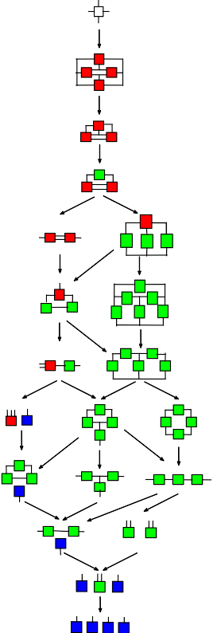

## OCCAM: Reconstructability Analysis Tools
**O**rganizational **C**omplexity **C**omputation **a**nd **M**odeling.

{:class="ra-img"} OCCAM combines machine learning, data mining, and statistical analysis in a powerful workflow that can be applied to to both categorical and quantitative data to understand its structure, select among possible models, and make predictions or discover variable associations. It is a collection of software tools comprising a library with both command-line and web interfaces for *Reconstructability Analysis* (RA), an information-theoretic form of statistical analysis closely related to [Bayesian Networks](https://en.wikipedia.org/wiki/Bayesian_network){:target="_blank"} and [log-linear modeling](https://en.wikipedia.org/wiki/Log-linear_model){:target="_blank"}.

The OCCAM project has been developed over several decades at Portland State University under the auspices of its creator Prof. Martin Zwick. Programmers contributing to the work have included Ken Willett, Joe Fusion and H. Forrest Alexander. The primary focus of development efforts at this time is to make OCCAM open source, and to repackage it to provide easy access for researchers, data scientists, and developers who wish to access the functionality in a standard way.

The [current working version of OCCAM](http://dmm.sysc.pdx.edu/weboccam.cgi) and some [introductory and research material](https://www.pdx.edu/sysc/research-discrete-multivariate-modeling) is maintained at Portland State University.

For an introduction to the software and the method, see:
* <a href = "what-is-occam.html">What is OCCAM and how does it work?</a>
* <a href = "what-is-reconstructibility-analysis.html">What is Reconstructibility Analysis?</a>

Want to contribute to the OCCAM project? See the *[Getting Started](getting-started.html)* page for links to project resources.

This software is currently being released for the first time as Free Software under the GPL v3 or later. Please see the [License](license.md) in this distribution for license terms.

As of right now, the software will be a bit challenging to get started with. There is documentation included, but it is rather out-of-date. The core functionality is encapsulated in a fairly standard C++ library whose interface should be relatively understandable to anyone familiar with both C++ and RA. Help making this software more generally and broadly usable would be greatly appreciated.

Here is the current [project roadmap](roadmap.md), if you have an interest in any of the project areas, learn about becoming a [contributor](contributors/).
